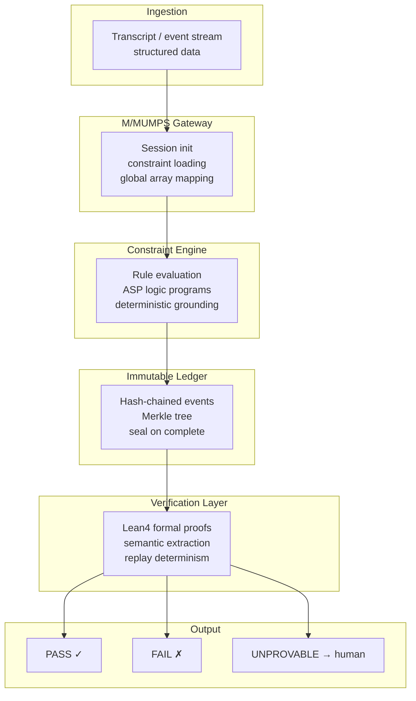
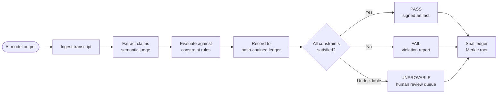
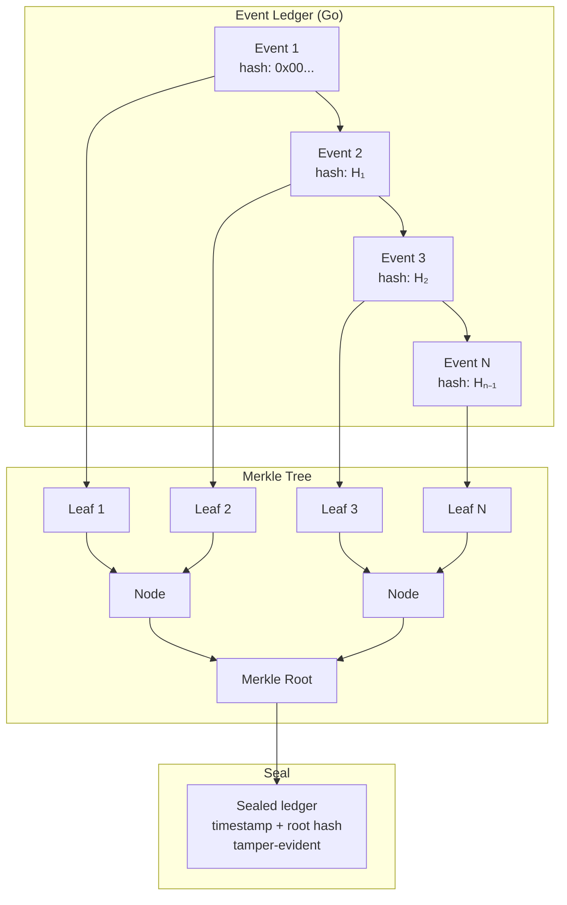
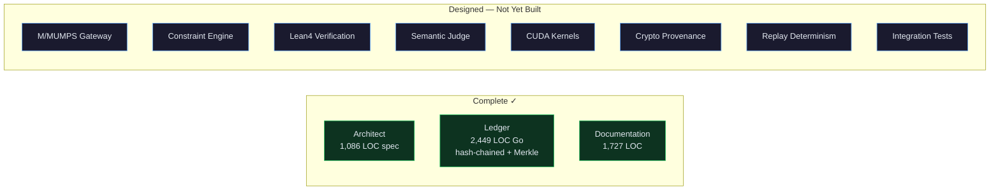

```
┌─────────────────────────────────────────────────────────────────────────────┐
│                                                                             │
│   ███████╗ ██████╗ ██╗   ██╗███████╗██████╗ ███████╗██╗ ██████╗ ███╗   ██╗ │
│   ██╔════╝██╔═══██╗██║   ██║██╔════╝██╔══██╗██╔════╝██║██╔════╝ ████╗  ██║ │
│   ███████╗██║   ██║██║   ██║█████╗  ██████╔╝█████╗  ██║██║  ███╗██╔██╗ ██║ │
│   ╚════██║██║   ██║╚██╗ ██╔╝██╔══╝  ██╔══██╗██╔══╝  ██║██║   ██║██║╚██╗██║ │
│   ███████║╚██████╔╝ ╚████╔╝ ███████╗██║  ██║███████╗██║╚██████╔╝██║ ╚████║ │
│   ╚══════╝ ╚═════╝   ╚═══╝  ╚══════╝╚═╝  ╚═╝╚══════╝╚═╝ ╚═════╝ ╚═╝  ╚═══╝│
│                                                                             │
│   ███████╗██╗   ██╗ █████╗ ██╗         ███████╗███╗   ██╗ ██████╗           │
│   ██╔════╝██║   ██║██╔══██╗██║         ██╔════╝████╗  ██║██╔════╝           │
│   █████╗  ██║   ██║███████║██║         █████╗  ██╔██╗ ██║██║  ███╗          │
│   ██╔══╝  ╚██╗ ██╔╝██╔══██║██║         ██╔══╝  ██║╚██╗██║██║   ██║          │
│   ███████╗ ╚████╔╝ ██║  ██║███████╗    ███████╗██║ ╚████║╚██████╔╝          │
│   ╚══════╝  ╚═══╝  ╚═╝  ╚═╝╚══════╝    ╚══════╝╚═╝  ╚═══╝ ╚═════╝          │
│                                                                             │
│   Self-Auditing AI Evaluation Engine                                        │
│   Deterministic · Air-gapped · Immutable audit trail                        │
│                                                                             │
└─────────────────────────────────────────────────────────────────────────────┘
```


---

## What is this?

A deterministic, air-gapped system for evaluating whether AI model outputs comply with explicit constraints. The engine answers one question: **Did this AI system do what it was told?**

The model proposes. The system verifies. Every evaluation produces a cryptographically-signed artifact that proves compliance or failure. No ambiguity — results are PASS, FAIL, or UNPROVABLE (routed to human review).

No cloud dependency. No external API calls. Runs entirely on local hardware in regulated environments.

---

## Architecture



## Evaluation Pipeline



## Ledger Architecture



## Component Status



---

## Project Structure

```
sovereign-eval-engine/
├── docs/
│   ├── SOVEREIGN_AI_EVALUATION_ENGINE.md    Full implementation guide (1,727 LOC)
│   └── SOVEREIGN_EVALUATION_ENGINE_SPEC.md  Architecture specification (1,086 LOC)
│
└── ledger/                                  Immutable event ledger (Go)
    ├── go.mod                               Module definition
    ├── event.go                             Event types, severity, categories (401 LOC)
    ├── ledger.go                            Hash-chained ledger + Merkle tree (497 LOC)
    ├── serialization.go                     JSON/binary serialization (358 LOC)
    ├── io.go                                File I/O, compression, export (389 LOC)
    ├── ledger_test.go                       Test suite (525 LOC)
    ├── example_test.go                      Usage examples (279 LOC)
    ├── IMPLEMENTATION.md                    Implementation notes
    ├── MANIFEST.txt                         File manifest
    └── README.md                            Ledger-specific documentation
```

---

## Design Principles

| Principle | What it means |
|-----------|---------------|
| **Model proposes, system verifies** | AI output is evidence, not proof — the engine independently confirms or refutes |
| **Deterministic** | Same input always produces the same evaluation — reproducible, auditable |
| **Immutable audit trail** | Hash-chained ledger with Merkle tree — tampering is detectable |
| **Air-gapped** | No cloud, no external APIs, no internet required — runs on local hardware |
| **Explicit failure modes** | PASS / FAIL / UNPROVABLE — no ambiguity, humans handle edge cases |

## Ledger Features

| Feature | Description |
|---------|-------------|
| **Hash chaining** | SHA-256 chain — each event's hash includes the previous event's hash |
| **Merkle tree** | Binary Merkle tree over all events for O(log n) inclusion proofs |
| **Seal** | Ledger can be sealed (made permanently immutable) with timestamp |
| **Event types** | CLAIM, CONSTRAINT_CHECK, CONSTRAINT_RESULT, EVALUATION_START/END, VERIFICATION, SEAL, ERROR |
| **Severity levels** | INFO, WARNING, ERROR, CRITICAL |
| **Compression** | gzip-compressed binary serialization for storage |
| **Thread safety** | RWMutex-protected for concurrent access |

---

## Build

```bash
cd ledger
go test ./...
```

---

## License

Dual-licensed under [GPL-2.0](https://www.gnu.org/licenses/old-licenses/gpl-2.0.html) or [AGPL-3.0](https://www.gnu.org/licenses/agpl-3.0.html). See [LICENSE](LICENSE) for details.

Copyright (c) 2026 BEL ESPRIT D ACCORD.
